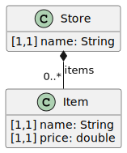
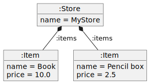

# DynamicEMF
This repository is an example of a project to create and read Eclipse Modelling Frameworks (EMF) meta-models and models dynamically using Java. 
The repository contains an Eclipse project with two directories. The directory src contains de source files of the project, and models is the directory where the created models will be saved. The last one, also contains images of the examples models.   

# Source Files
The src directory contains the source files of the project, with two packages: dynamicEMF and plantUML.diagram. It is this explanation that we will focus in dynamicEMF. 
This package contains four classes, each of them with a main method.

* CreateMetamodel.java: to create the meta-model showed in Fig.1. using emf libraries in java.
* CreateModel.java: to create the model showed in Fig.2. using emf libraries in java. It needs the meta-model created when execute CreateMetamodel.java.
* ReadMetamodel.java: to read and print a meta-model. It needs the meta-model created when execute CreateMetamodel.java. 
* ReadModel.java: to read and print a model. It needs the model created when execute CreateModel.java.  

Fig.1 - UML Class diagram of the metamodel created in CreateMetamodel.java

Fig.2 - UML Object diagram of the model created in CreateModel.java

